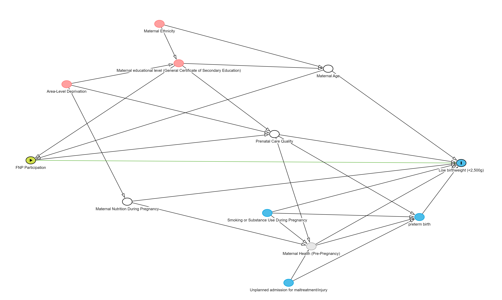
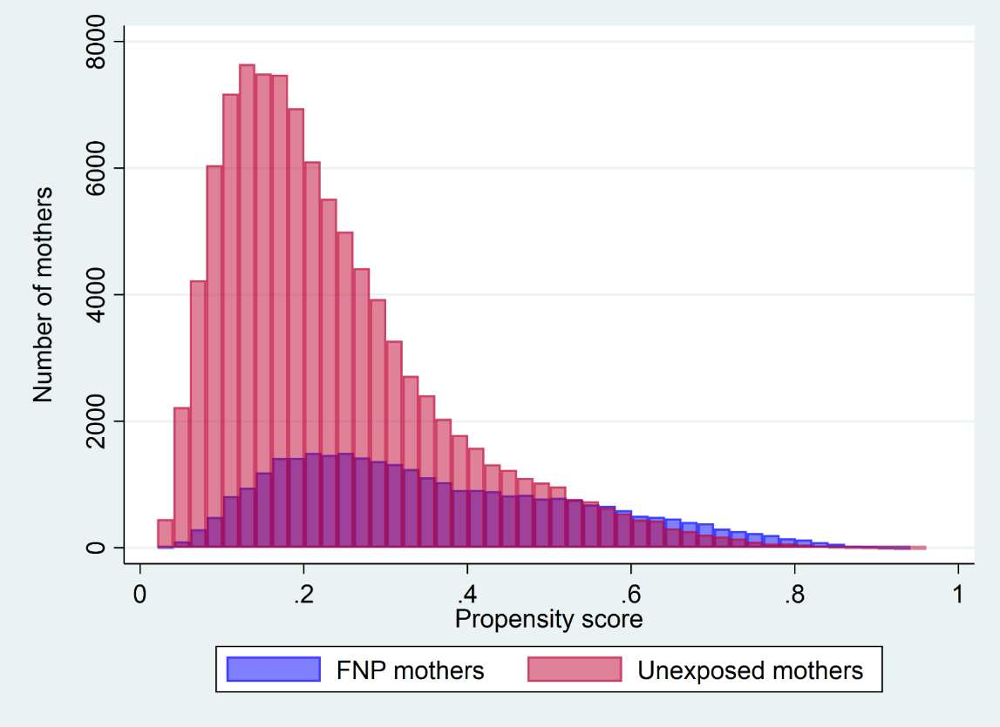

```{r setup, include=FALSE}
knitr::opts_chunk$set(echo = TRUE) # global chunk options here

library(dagitty)
library(ggdag)
library(ggplot2)
library(MatchIt)
library(dplyr)
library(lme4)
```


## Student declaration

**_Instructions: Indicate that you understand and agree with the following three statements by typing an x in the square brackets below, e.g. [x]._** 

I declare that this assessment item is my own work, except where acknowledged, and has not been submitted for academic credit elsewhere or previously, or produced independently of this course (e.g. for a third party such as your place of employment) and acknowledge that the assessor of this item may, for the purpose of assessing this item: (i) Reproduce this assessment item and provide a copy to another member of the University; and/or (ii) Communicate a copy of this assessment item to a plagiarism checking service (which may then retain a copy of the assessment item on its database for the purpose of future plagiarism checking).  

- [X] I understand and agree

I certify that I have read and understood the University Rules in respect of Student Academic Misconduct.  

- [X] I understand and agree

I have a backup copy of the assessment.  

- [X] I understand and agree


## Statement on the use of generative AI
**_Instructions: If you have used Generative AI tools (e.g. ChatGPT, copilot, etc) to help complete this assessment, please state the details here. Your statement should include (i) the name of tool used; (ii) sections or questions that were answered with the help of generative AI; (iii) How generative AI was used. For example you might write "I used Microsoft Copilot to generate template R code for questions 1 and 2, and to help draft my written response to question 4." If you have not used Generative AI to help complete your assessment, please state this._**

I use Generative AI tool (ChatGPT) to 
1. summary the paper and supplementary file. 
2. check if I answered every point of the questions and the spelling and grammar of my answer. 
3. replace "..." and [...] from model code given by online [dagitty] tool into \"...\" deal with error in DAG code
4. help to draft my written response to hits in question 2 and summary and optimise my written response to question five 
5. reformat text


### Question 1 (15 marks)

Draw a Directed Acyclic Graph (DAG) that could be used to inform the
analysis estimating the total and direct effect of program participation
on the risk of being born low birth weight.

```{r DAG via code, echo=FALSE, results='hide', warning=FALSE, message=FALSE, fig.height=8, fig.width=12}
# Define the DAG using the dagitty function and the model code given by online [dagitty](https://dagitty.net/dags.html) tool
dag <- dagitty("
dag {
    \"Area-Level Deprivation\" [pos=\"-1.343,-1.064\"]
    \"FNP Participation\" [exposure,pos=\"-1.539,-0.437\"]
    \"Low birthweight (<2,500g)\" [outcome,pos=\"0.167,-0.410\"]
    \"Maternal Age\" [adjusted,pos=\"-0.411,-1.185\"]
    \"Maternal Ethnicity\" [pos=\"-1.038,-1.586\"]
    \"Maternal Health (Pre-Pregnancy)\" [latent,pos=\"-0.471,0.199\"]
    \"Maternal Nutrition During Pregnancy\" [adjusted,pos=\"-1.127,-0.149\"]
    \"Maternal educational level (General Certificate of Secondary Education)\" [pos=\"-0.962,-1.208\"]
    \"Prenatal Care Quality\" [adjusted,pos=\"-0.582,-0.578\"]
    \"Smoking or Substance Use During Pregnancy\" [pos=\"-0.628,-0.061\"]
    \"Unplanned admission for maltreatment/injury\" [pos=\"-0.552,0.483\"]
    \"preterm birth\" [pos=\"-0.002,0.008\"]
    \"Area-Level Deprivation\" -> \"Maternal Nutrition During Pregnancy\"
    \"Area-Level Deprivation\" -> \"Maternal educational level (General Certificate of Secondary Education)\"
    \"Area-Level Deprivation\" -> \"Prenatal Care Quality\"
    \"FNP Participation\" -> \"Low birthweight (<2,500g)\"
    \"FNP Participation\" -> \"Prenatal Care Quality\"
    \"Maternal Age\" -> \"FNP Participation\"
    \"Maternal Age\" -> \"Low birthweight (<2,500g)\"
    \"Maternal Ethnicity\" -> \"Maternal Age\"
    \"Maternal Ethnicity\" -> \"Maternal educational level (General Certificate of Secondary Education)\"
    \"Maternal Health (Pre-Pregnancy)\" -> \"Low birthweight (<2,500g)\"
    \"Maternal Health (Pre-Pregnancy)\" -> \"preterm birth\"
    \"Maternal Nutrition During Pregnancy\" -> \"Low birthweight (<2,500g)\"
    \"Maternal Nutrition During Pregnancy\" -> \"Maternal Health (Pre-Pregnancy)\"
    \"Maternal educational level (General Certificate of Secondary Education)\" -> \"FNP Participation\"
    \"Maternal educational level (General Certificate of Secondary Education)\" -> \"Maternal Age\"
    \"Maternal educational level (General Certificate of Secondary Education)\" -> \"Prenatal Care Quality\"
    \"Prenatal Care Quality\" -> \"Low birthweight (<2,500g)\"
    \"Prenatal Care Quality\" -> \"Maternal Health (Pre-Pregnancy)\"
    \"Prenatal Care Quality\" -> \"preterm birth\"
    \"Smoking or Substance Use During Pregnancy\" -> \"Low birthweight (<2,500g)\"
    \"Smoking or Substance Use During Pregnancy\" -> \"Maternal Health (Pre-Pregnancy)\"
    \"Smoking or Substance Use During Pregnancy\" -> \"preterm birth\"
    \"Unplanned admission for maltreatment/injury\" -> \"Maternal Health (Pre-Pregnancy)\"
    \"Unplanned admission for maltreatment/injury\" -> \"preterm birth\"
    \"preterm birth\" -> \"Low birthweight (<2,500g)\"
}
")


# Visualize the DAG
ggdag(dag) +
  geom_dag_point (size = 10, color = "white", fill = NA, stroke = 0) + 
  geom_dag_text (colour = "black", size = 3) +
  theme_minimal () +
  theme (
    plot.title = element_text(size = 14, face = "bold"),
    panel.background = element_rect(fill = "white", color = NA),
    plot.background = element_rect(fill = "white", color = NA)
  ) +
  ggtitle ("DAG for FNP Participation and Low Birthweight")

```

```{r DAG from web tool, echo=FALSE, out.width="100%", fig.align='center'}

```

### Question 2 (15 marks)

Write a brief descriptive paragraph that highlights any non-causal or backdoor path(s) and potential variables that might be useful to close the path(s).

1. **Maternal Characteristics** 
Figure 3 in paper shows the adjusts for various maternal characteristics before enrollment in the FNP program, such as age, ethnicity, area-level deprivation, and educational level. These characteristics are important confounders as they influence both the likelihood of participating in the FNP and the risk of adverse birth outcomes (low birth weight). 
Maternal age is a common cause of both FNP participation and low birth weight. Younger mothers are more likely to participate in the FNP program, and younger maternal age is also associated with a higher risk of low birth weight. 
Similarly, maternal educational levels, which could affect both the likelihood of FNP participation and maternal health outcomes. The General Certificate of Secondary Education (GCSE) is a standard qualification for adolescents in the age range of 13–19 years, so it is an important factor in assessing the overall educational engagement of these young mothers. School attendance is also critical, for example, lower school attendance could be associated with socio-economic challenges, increasing the need for support through the FNP; or may be a consequence of worse health situations, where poor health could lead to absences from school, impacting both the mother's likelihood of participating in the FNP and her child's birth outcomes. 

2. **Area-Level Deprivation**
This variable is a potential key confounder, since it affects access to the FNP program and is also associated with socioeconomic stressors that may impact birth outcomes and maternal health. Mothers from more deprived areas may have lower access to resources, contributing to a higher risk of low birth weight. Simultaneously, these mothers may be more likely to access the FNP program, which targets vulnerable populations.

3. **Maternal Health and Behavior (Pre-Pregnancy)**
A mother's health status and behavior (such as smoking or substance use) before pregnancy could influence both her likelihood of participating in the FNP program and the risk of having a child with low birth weight. For example, a mother with pre-existing health conditions might be more likely to attracted by the additional care/support in the FNP. Also, these pre-existing vulnerabilities (include mental health and adversity) might cause higher risk of adverse birth outcomes that are not directly caused by the FNP but could confound the analysis and bias the observed effect if not adjusted for. 

4. **Residual Confounding and Unmeasured Variables**
Despite the propensity score matching approach, the paper highlights that residual confounding is a concern due to the inability to capture certain maternal risk factors in administrative data. For example, less severe mental health conditions, family support and risk of unstable housing were not directly measured.The inability to adjust for these unmeasured confounders may introduce bias, limiting the ability to detect the true effect of the FNP program.


### Question 3 (10 marks)

Describe the distribution of the propensity score for mothers who
participated in the program and unexposed mothers. Comment on whether
the assumption of positivity is met with respect to the propensity
score.

```{r Figure1, echo=FALSE, out.width="100%", fig.align='center'}

```

The propensity score represents the probability of each mother enrolling in the FNP program based on observed covariates, such as maternal age, ethnicity, area-level deprivation, educational attainment, and health status before pregnancy.

- As shown in 'Appendix Figure 2'(above), FNP mothers tended to have higher propensity scores (median = 0.39) compared to non-FNP mothers (median = 0.31). This difference in medians indicates that mothers who participated in the FNP program had more risk factors that made them likely to enroll in the program compared to those who did not participate.
- The distribution of propensity scores for both groups ranges from approximately 0.05 to 0.9. While the non-FNP mothers have a more concentrated distribution with many having lower propensity scores, there is substantial overlap between the two groups in the range of 0.2 to 0.6.

The positivity assumption requires that for every combination of covariates, there is a non-zero probability of receiving either exposure (participate in FNP) or control (not participate in FNP). This ensures that the exposure and control groups have overlapping propensity scores, allowing for meaningful/balanced comparison. 

- The observed overlap between FNP mothers and unexposed mothers in Appendix Figure 2 indicates he positivity assumption is met. 
- The good overlap of propensity scores allowed the researchers to include 94.9% of mothers in the matched analysis for births between April 2010 and 2019, and 95.7% and 99.9% of mothers in the cohorts with 2 and 7 years of follow-up, respectively.
- However, it is worth noting that the tails of the distribution (lower and higher extremes) show fewer matches, indicating that mothers with very low or very high probabilities of enrolling in FNP are less represented in both groups.


## Section 2 (60%)

In this section you will undertake a matching analysis using simulated
data which has been designed to roughly emulate the Family Nurse
Partnership evaluation from Section 1. The data is stored in the
dataframe `fnp-data.Rda`. You can load it into your environment using
the code

```{r load data, echo=FALSE, results='hide', warning=FALSE, message=FALSE}
load('fnp-data.Rda')
head(df)
```

the following six variables are included:

- **fnp** A binary indicator of participation in a Family Nurse
  Partnership evaluation

- **mat_age** Maternal age, measured in years

- **ethnicity** Mother’s ethnicity

- **deprivation** Area level deprivation on a scale from 1 (least
  deprived) to 10 (most deprived)

- **bweight** Birthweight, measured in grams

- **devVuln** An indicator for child developmental vulnerability,
  measured at age 5

The key research question of interest is to evaluate the total effect of
program participation on the risk of being born low birth weight
(\<2,500g).

### Question 1 (20 marks)

Undertake an exploratory analysis, using tables and/or figures to
describe the distribution and key associations in the data. Make sure to
support each table/figure with a few lines of interpretative text.

```{r Add low birth weight variable, echo=FALSE, warning=FALSE, message=FALSE}
library(dplyr)
library(ggplot2)

df <- df %>%
  mutate(low_birth_weight = ifelse(bweight < 2500, 1, 0))

summary(df)

df %>% 
  group_by(fnp) %>% 
  summarize(
    count = n(),
    mean_age = mean(mat_age, na.rm = TRUE),
    mean_bweight = mean(bweight, na.rm = TRUE),
    low_birth_weight_rate = mean(low_birth_weight),
    mean_deprivation = mean(deprivation)
  )
```

```{r Visualize the distribution of Maternal Age by FNP Participation, echo=FALSE, warning=FALSE, message=FALSE, fig.align='center'}
ggplot(df, aes(x = as.factor(mat_age), fill = as.factor(fnp))) +
  geom_bar(position = "dodge", alpha = 0.7) +
  geom_text(
    stat = 'count',
    aes(label = ..count..),
    position = position_dodge(width = 0.9),
    vjust = -0.5,
    size = 3
  ) +
  scale_fill_manual(values = c("lightblue", "pink"), labels = c("Non-FNP", "FNP")) +
  labs(
    title = "Distribution of Maternal Age by FNP Participation",
    x = "Maternal Age",
    y = "Number of Mothers",
    fill = "FNP Participation"
  ) +
  theme_minimal() +
  theme(axis.text.x = element_text(angle = 45, hjust = 1))

```

The bar chart shows the distribution of maternal age by FNP participation, for mothers who participated in the FNP program (in pink) and those who did not (in lightblue).

- There are more Non-FNP mothers across all ages
- FNP participants are more concentrated in the younger age groups (16-19 years), with the frequency decreasing as maternal age increases. 
- For older maternal ages (22-25 years), there is no FNP participants. These age groups have zero probability of being treated (participating in FNP). Thus the positivity assumption is not met for this subset of the data, which limits the generalisability of the findings to that age range.
- Subset analysis or sensitivity analysis could be options.


```{r Visualize the distribution of Ethnicity Distribution by FNP Participation, echo=FALSE, warning=FALSE, message=FALSE, fig.align='center'}
df %>%
  group_by(fnp, ethnicity) %>%
  summarize(count = n()) %>%
  mutate(proportion = count / sum(count)) %>%
  ggplot(aes(x = ethnicity, y = proportion, fill = as.factor(fnp))) +
  geom_bar(stat = "identity", position = "dodge", alpha = 0.7) +
  scale_fill_manual(values = c("lightblue", "pink"), labels = c("Non-FNP", "FNP")) +
  labs(
    title = "Ethnicity Distribution by FNP Participation",
    x = "Ethnicity",
    y = "Proportion",
    fill = "FNP Participation"
  ) +
  theme_minimal() +
  theme(axis.text.x = element_text(angle = 45, hjust = 1))


```

The Ethnicity Distribution by FNP Participation bar chart shows the proportion of each ethnic group among FNP participants and non-participants.

- White mothers present the largest proportion in Non-FNP group and second large proportion in FNP group.
- South Asian and Black mothers have smaller and similar proportions in both groups.
- Other ethnicities show highest proportion among FNP participants.  
- The differences in ethnicity proportions between the two groups might reflect the demographic characteristics of the areas where the FNP is implemented.


```{r Visualize the distribution of LBW, echo=FALSE, warning=FALSE, message=FALSE, fig.align='center'}
ggplot(df, aes(x = bweight, fill = as.factor(fnp))) +
  geom_histogram(alpha = 0.5, position = "identity", bins = 30) +
  scale_fill_manual(values = c("lightblue", "pink"), labels = c("Non-FNP", "FNP")) +
  labs(
    title = "Distribution of Birth Weight by FNP Participation",
    x = "Birth Weight (grams)",
    y = "Count",
    fill = "FNP Participation"
  ) +
  theme_minimal()

```

The histogram shows the distribution of birth weights for mothers who participated in the FNP program (in pink) and those who did not (in lightblue).

- The distributions are largely similar, with most births occurring around 3,000 to 3,500 grams.
- Compared to non-participants, the distribution for FNP participants has a slightly higher concentration of births at lower weights.
- The overlap in the distributions indicate the positivity assumption is met.


```{r Visualize the rate of LBW, echo=FALSE, warning=FALSE, message=FALSE, fig.align='center'}
df %>%
  group_by(fnp) %>%
  summarize(low_birth_weight_rate = mean(low_birth_weight)) %>%
  ggplot(aes(x = as.factor(fnp), y = low_birth_weight_rate, fill = as.factor(fnp))) +
  geom_bar(stat = "identity", alpha = 0.7) +
  geom_text(
    aes(label = scales::percent(low_birth_weight_rate, accuracy = 0.1)),
    vjust = -0.5,  # Adjusts the vertical position of the text above the bar
    size = 4
  ) +
  scale_fill_manual(values = c("lightblue", "pink"), labels = c("Non-FNP", "FNP")) +
  labs(
    title = "Proportion of Low Birth Weight (<2,500g) by FNP Participation",
    x = "FNP Participation",
    y = "Proportion with Low Birth Weight",
    fill = "FNP Participation"
  ) +
  theme_minimal()

```

The bar plot displays the proportion of low birth weight (<2,500g) among FNP participants (about 3%) and non-participants (about 1.2%).

- The higher rate of low birth weight among FNP participants suggests that mothers who joined the FNP program had a greater likelihood of experiencing adverse birth outcomes. 
- This might reflect the FNP program's focus on supporting mothers who are at higher risk, such as younger mothers or those with more socio-economic challenges.


```{r Visualize the relationship Between deprivation and of LBW, echo=FALSE, warning=FALSE, message=FALSE, fig.align='center'}
ggplot(df, aes(x = as.factor(low_birth_weight), y = deprivation, fill = as.factor(low_birth_weight))) +
  geom_boxplot() +
  scale_fill_manual(values = c("lightblue", "pink"), labels = c("Normal Birth Weight", "Low Birth Weight")) +
  labs(
    title = "Deprivation Score by Low Birth Weight Status",
    x = "",
    y = "Deprivation Score",
    fill = "Birth Weight Status"
  ) +
  theme_minimal()

```

The boxplot display the deprivation score by LBW Status.

- The higher median deprivation score in the low birth weight group indicate the Higher deprivation is associated with a greater risk of having a low birth weight baby.
- The narrower spread of deprivation scores in the low birth weight group indicates that mothers who experience higher levels of deprivation are more consistently at risk of having a low birth weight baby
- This relationship suggests that deprivation is an important factor to adjust for when analyzing the effects of the FNP program on LBW outcomes, as it could confound the observed association between FNP participation and LBW.


### Question 2 (10 marks)

Undertake matching to evaluate the effect of program participation on
the risk of being born low birth weight (birth weight \<2,500g).

```{r Q2_1, warning=FALSE, message=FALSE}
# Ensure low birth weight indicator is binary (1 if birth weight < 2500g, else 0)
df <- df %>%
  mutate(low_birth_weight = ifelse(bweight < 2500, 1, 0))

# Perform propensity score matching
ps_model <- matchit(fnp ~ mat_age + ethnicity + deprivation, data = df, method = "nearest", distance = "glm") # ratio = 1 is the default setting

# Extract the matched data
matched_data <- match.data(ps_model)
```

performing propensity score matching using the `MatchIt` package with the **nearest neighbor method** and a **generalized linear models (glm)** model to estimate the propensity scores for FNP participation. The model includes maternal age, ethnicity, and deprivation as covariates to predict participation.

Hints: 

- `distance = 'glm'`
  - This setting in `MatchIt` uses generalized linear models for estimating the propensity score, typically using a **logistic regression** model when the outcome is binary (treatment vs. control).
  - `glm` is a general framework that can include other types of regression models beyond logistic regression, such as probit or others.For binary outcomes like being born LBW here, using `distance = 'glm'` will effectively fit a **logit model** under the hood, assuming not specify a different family for the GLM.

- `distance = 'logit'`
  -  This explicitly uses a **logistic regression** model to estimate the propensity scores.
  -  It is essentially equivalent to using `distance = 'glm'` for binary treatment if not specifying other options in `glm`.
  -  using `'logit'` is more direct, using `'glm'` is more general.

- `method = 'optimal', distance = 'mahalanobis'`
  - Optimal matching aims to minimize the total distance between matched pairs by finding the best overall set of matches for each treated unit. It considers all possible pairings and selects the configuration with the lowest overall matching distance to improve balance.
  - This can lead to better balance compared to simple nearest-neighbor matching, as it tries to optimize the matches over the entire dataset rather than sequentially finding the nearest matches.
  - It is more computationally intensive than nearest-neighbor matching, especially with larger datasets.
  - When using **Mahalanobis distance** for matching, the matching is based on the **covariate space** directly rather than estimating a propensity score.
  - The Mahalanobis distance takes into account the **correlation between covariates** and scales them according to their variances, providing a more accurate distance measure than simple Euclidean distance.
  - This is often used for matching when there is a small number of covariates or when want to ensure that treated and control units are similar on those covariates in a multivariate sense.
     
- `method = 'cem'`
  - Coarsened Exact Matching ('cem') involves grouping the covariates into coarser categories (bins) and then matching treated and control units that fall into the same categories. For example, age could be grouped into ranges, and matching is performed within these ranges.
  - 'cem' improves balance by forcing exact matches within these coarser groups, which can be effective when want to control for a few key covariates and avoid large imbalances.


### Question 3 (10 marks)

Summarise the balance in the dataset before and after matching using
appropriate figures and/or tables. Make sure to include a few lines of
text commenting on what you find.

```{r Q3, echo=FALSE, warning=FALSE, message=FALSE}
# Summary of the matched data to check balance
summary(ps_model)

```

The original dataset had 1,787 FNP participants, one-to-one matching performed without replacement resulting in a dataset with with 1,787 FNP participants mothers and 1,787 matched controls. <br>

- Before matching, there were significant differences between FNP participants and non-participants across **Distance (Propensity Scores)**, **maternal age**, **ethnicity (White and other)**, and **deprivation**.
- After matching, these differences were significant addressed (Std. Mean Diff decreased, variance ratio close to 1, eCDF Mean and eCDF Max decreased), resulting in a more comparable matched dataset


Hints: <br>

- **Variance Ratios** of **1**  means that the variances in the treated and control groups are identical, the acceptable range of variance ratios is generally between 0.8 and 1.25.
- **eCDF Mean**: This measures the **average absolute difference** between the **empirical cumulative distribution functions (eCDFs)** of the treated and control groups across all covariates. A lower value indicates better alignment between the distributions of treated and control groups.
- **eCDF Max**: This measures the **maximum absolute difference** between the **eCDFs** of the treated and control groups across all covariates. It focuses on the largest difference in distribution between the groups.


### Question 4 (10 marks)

Use an appropriate linear model to estimate the effect of program
participation in (i) the raw data and (ii) the matched data.

- In this context, since the outcome variable ('low_birth_weight') is binary (0 or 1), it is indeed appropriate to use a logistic regression model 'gml()' rather than a linear model. 

```{r Q4_1, echo=FALSE, warning=FALSE, message=FALSE}
# Fit logistic regression model on the raw data data
logit_model_i <- glm(low_birth_weight ~ fnp, data = df, family = "binomial")

# Summarize the results
summary(logit_model_i)

# Calculate odds ratio and 95% confidence interval
exp(cbind(OR = coef(logit_model_i), confint(logit_model_i)))
```
Model (i): Logistic regression on the raw data <br>
- **Intercept**:
  - Estimate: **-4.4534** represents the **log-odds** of a non-FNP mother having a low birth weight baby in the raw (unmatched) data.
  - The corresponding **odds ratio (OR)** is **0.0116** (95% CI: 0.0096 - 0.0140), indicating that the odds of having a low birth weight baby for a non-FNP mother are **1.16%** in the unmatched sample.

- **FNP Participation (fnp)**:
  - Estimate:  **0.9848** indicates that FNP participation is associated with an **increase in the log-odds** of having a low birth weight baby in the unmatched data.
  - Converted to **odds ratio (OR)**: **2.6771 (95% CI: 1.9109 - 3.7075).
    - This suggests that FNP participants have **2.68 times higher odds** of having a low birth weight baby compared to non-participants in the raw data.
    - The p-value for fnp is **5.31e-09**, which is statistically significant at the 5% significance level, indicating that this observed effect is unlikely to be due to chance.
    - The 95% confidence interval does not include 1, further suggesting that the effect of FNP participation is statistically significant in the raw data.

```{r Q4_2, echo=FALSE, warning=FALSE, message=FALSE}
# Fit logistic regression model on the matched data
logit_model_ii <- glm(low_birth_weight ~ fnp, data = matched_data, family = "binomial")

# Summarize the results
summary(logit_model_ii)

# Calculate odds ratio and 95% confidence interval
exp(cbind(OR = coef(logit_model_ii), confint(logit_model_ii)))
```
Model (ii): Logistic regression on the matched data <br>
- **Intercept**:
  - Estimate: **-3.1998** indicates the **log-odds** of a non-FNP mother having a low birth weight baby.
  - When converted to **odds ratio (OR)**, it equals **0.0408** (95% CI: 0.0318 - 0.0513). This suggests that, in the matched control group (non-FNP mothers), the odds of having a low birth weight baby are **4.08%**.
  
- **FNP Participation (fnp)**:
  - Estimate: **-0.2688** indicates that FNP participation is associated with a **reduction in the log-odds** of having a low birth weight baby.
  - Converted to **odds ratio (OR)**: **0.7643** (95% CI: 0.5307 - 1.0949).
    - This suggests that FNP participants have **23.6% lower odds** of having a low birth weight baby compared to non-participants.
    - However, **P-value** for the **fnp** variable is **0.145**, which is greater than **0.05**, indicating that the effect of FNP participation on the likelihood of having a low birth weight baby is **not statistically significant** at the **5% significance level**.
    - Moreover, the **95% confidence interval** for the odds ratio includes **1**, indicating that the observed effect could be consistent with **lack of strong evidence for a significant difference ** between FNP participants and non-participants.


In the **matched data**, after controlling for differences in **maternal age**, **ethnicity**, and **deprivation**, the direction of the association changes, suggesting a **potential reduction** in the odds of low birth weight with FNP participation, but this result is **not statistically significant**. which indicate that the initial association might confounded by differences between the groups.

The matched data supports a more balanced comparison, making it a more reliable estimate of the effect of **FNP participation** on **low birth weight**.


```{r Q4_3, echo=FALSE, warning=FALSE, message=FALSE}
# Subset data to ages 16-21
df_subset <- df %>% filter(mat_age >= 16 & mat_age <= 21)

# Perform propensity score matching on the subset
ps_model_subset <- matchit(fnp ~ mat_age + ethnicity + deprivation, data = df_subset, method = "nearest", distance = "glm") # still can not apply method = 'optimal' here as computer will gets stuck

# Summary of the matched data to check balance
summary(ps_model_subset)

```
1,787 treated (FNP participants) and 4,953 controls (non-FNP participants) in the age range of 16-21 years. After performing 1:1 matching, resulting in a dataset with with 1,787 FNP participants mothers and 1,787 matched controls.

Before matching

- In the full data, there were significant imbalances, particularly in **maternal age** (SMD = -1.75), **distance (propensity scores)** (SMD = 1.16), and **deprivation** (SMD = 0.75).
- In the subset data (ages 16-21), imbalances were reduced but still present, with **distance** (SMD = 0.90) and **deprivation** (SMD = 0.85) showing the most substantial differences.
- Overall, the subset data had a better initial balance compared to the full data, reflecting more similar groups before matching.

After matching

- In the matched full data, the **Standardized Mean Differences (SMDs)** were all below **0.15**, indicating good balance. **Variance Ratios** approached **1**, and **eCDF measures** were significantly reduced, indicating improved similarity between treated and control groups.
- In the matched subset data, the **SMDs** were also below **0.15**, with most covariates showing even smaller differences compared to the full data. **eCDF Mean** and **Max** values were lower in the subset analysis, indicating a closer alignment of treated and control groups.

Conclusion

- Subset Analysis (16-21 years) provided a better initial balance before matching, reducing the degree of adjustments required.
- After matching, both the **full data** and **subset data** achieved good balance with low SMDs, close variance ratios, and improved eCDF measures, indicating that matching effectively adjusted for covariate differences.


```{r Q4_4, echo=FALSE, warning=FALSE, message=FALSE}
# Subset data to ages 16-21 (without matching)
raw_subset <- df %>% filter(mat_age >= 16 & mat_age <= 21)

# Fit logistic regression model on the raw subset data
logit_model_raw_subset <- glm(low_birth_weight ~ fnp, data = raw_subset, family = "binomial")

# Summarize the results for the raw subset analysis
summary(logit_model_raw_subset)
exp(cbind(OR = coef(logit_model_raw_subset), confint(logit_model_raw_subset)))


```
- The **logistic regression results for the raw subset data** are similar to those of the **raw full-range data**, showing a positive and significant association between **FNP participation** and **low birth weight**.

```{r Q4_5, echo=FALSE, warning=FALSE, message=FALSE}
# Extract matched data for the subset
matched_data_subset <- match.data(ps_model_subset)

# Fit logistic regression on matched subset data
logit_model_subset <- glm(low_birth_weight ~ fnp, data = matched_data_subset, family = "binomial")

# Summarize the results for the matched subset analysis
summary(logit_model_subset)
exp(cbind(OR = coef(logit_model_subset), confint(logit_model_subset)))

```

- The **logistic regression results for the matched subset data** are similar to those of the **matched full-range data**, showing a potential negative association between **FNP participation** and **low birth weight**, but without statistical significance.

- These indicate that the results are consistent within the **raw vs. matched** data comparisons, suggesting that matching alters the direction of the observed effect, likely due to better control for confounding factors like **age**, **ethnicity**, and **deprivation**.


### Question 5 (10 marks)

What are the implications for the positivity and consistency assumptions
in this example?

1. **Positivity Assumption**:
- The positivity assumption requires that all individuals have a non-zero probability of receiving both the treatment (FNP participation) and the control. In the **raw data analysis**, there are notable positivity issues, particularly for older maternal ages (22-25 years), where no FNP participants are observed. This means that the probability of participating in FNP for older mothers is effectively zero, which **violates the positivity assumption**.
- In the **subset analysis** (ages 16-21 years), the positivity assumption is better satisfied. The subset ensures a more balanced representation across treatment and control groups, as this age range had sufficient overlap in propensity scores between treated and control units. Therefore, focusing on the 16-21 age range helps to address the lack of overlap and strengthens the credibility of causal inferences within this subset.
- However, subset analysis **circumvents** the positivity issue by excluding age groups where overlap is absent (i.e., older ages) rather than directly **improve positivity**. Thus, the results of the subset analysis only apply to this younger age group and they are not generalizable beyond this group..
- **Matching** is the key method used to address positivity assumption by creating a balanced dataset for comparisons.


2. **Consistency Assumption**:
- The consistency assumption requires that the potential outcomes under treatment and control are well-defined and comparable for each individual. In this example, **FNP participation** is a clearly defined intervention, making consistency a reasonable assumption.
- The matched analysis helps achieve greater comparability between treated and control groups by **balancing covariates** like age, ethnicity, and deprivation, which enhances **consistency**. 
- However, **residual confounding** could still affect the observed outcomes, especially if some relevant covariates were not fully captured or controlled for. Moreover, residual confounding cannot be completely ruled out.
- The subset analysis does not directly affect consistency but helps to make the treatment effect more interpretable by focusing on a population segment that is more homogeneous and more likely to meet the assumptions required for causal inference.


