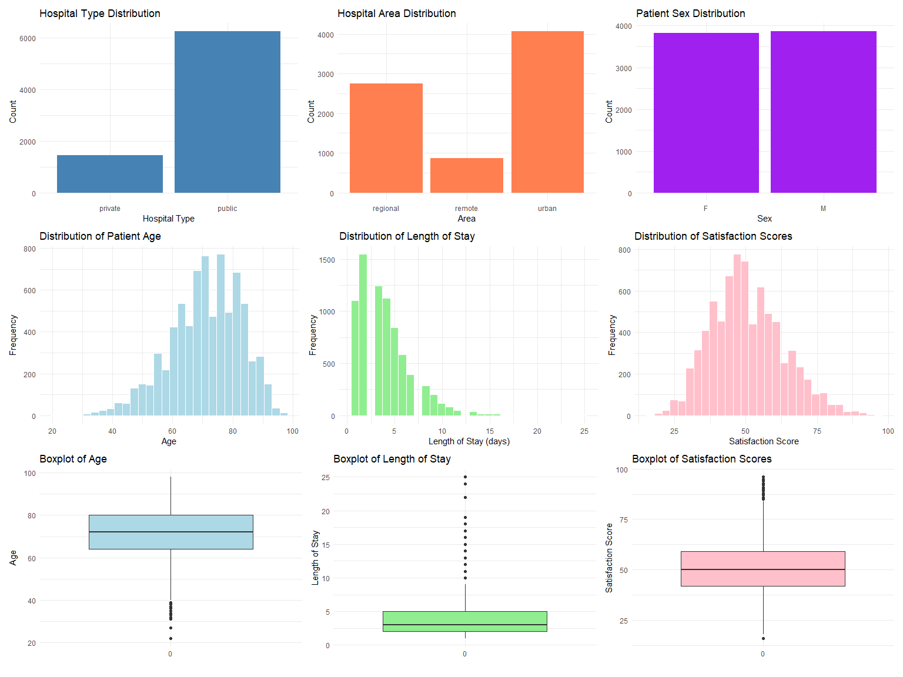
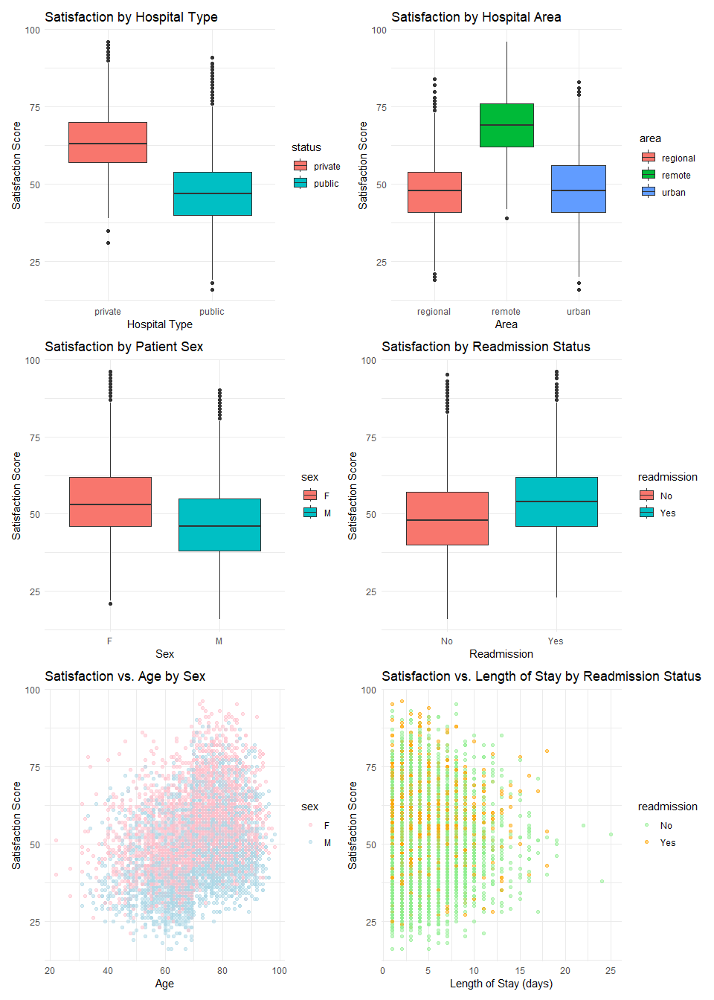
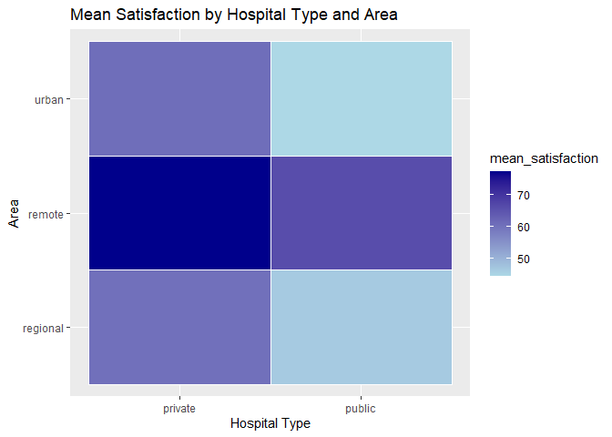
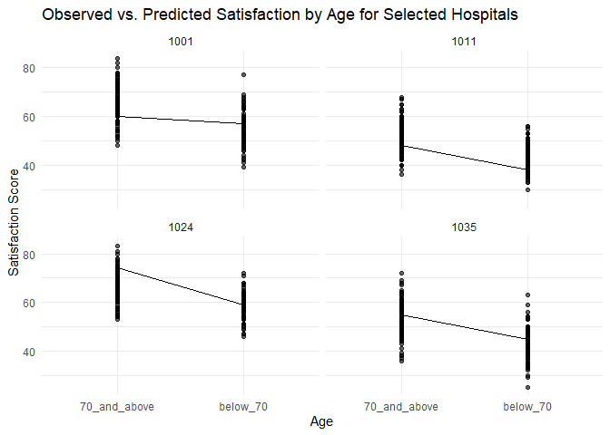
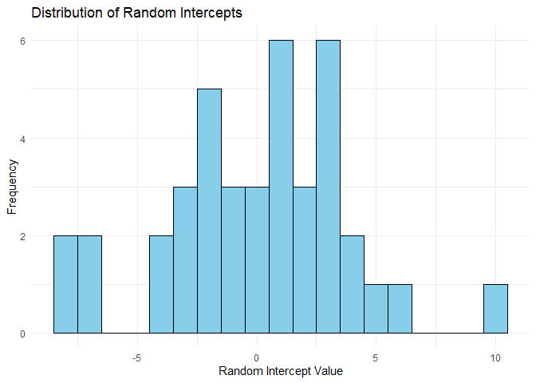
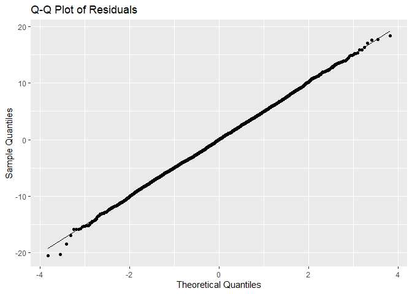
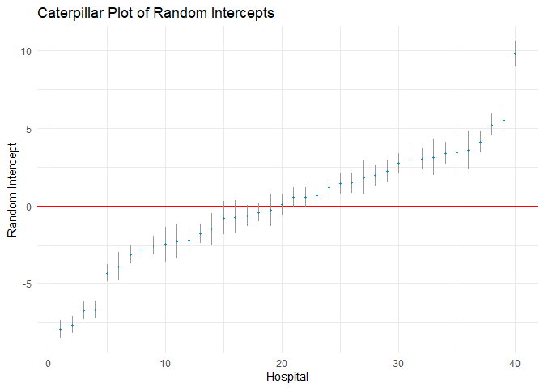

HDAT9700: Assessment 2 - Chapters 3-5
================
Zhenyu Zhang (z5037788)
25/10/2024

## Student declaration

***Instructions: Indicate that you understand and agree with the
following three statements by typing an x in the square brackets below,
e.g. \[x\].***

I declare that this assessment item is my own work, except where
acknowledged, and has not been submitted for academic credit elsewhere
or previously, or produced independently of this course (e.g. for a
third party such as your place of employment) and acknowledge that the
assessor of this item may, for the purpose of assessing this item: (i)
Reproduce this assessment item and provide a copy to another member of
the University; and/or (ii) Communicate a copy of this assessment item
to a plagiarism checking service (which may then retain a copy of the
assessment item on its database for the purpose of future plagiarism
checking).

- [x] I understand and agree

I certify that I have read and understood the University Rules in
respect of Student Academic Misconduct.

- [x] I understand and agree

I have a backup copy of the assessment.

- [x] I understand and agree

## Statement on the use of generative AI

***Instructions: If you have used Generative AI tools (e.g. ChatGPT,
copilot, etc) to help complete this assessment, please state the details
here. Your statement should include (i) the name of tool used; (ii)
sections or questions that were answered with the help of generative AI;
(iii) How generative AI was used. For example you might write “I used
Microsoft Copilot to generate template R code for questions 1 and 2, and
to help draft my written response to question 4.” If you have not used
Generative AI to help complete your assessment, please state this.***

## Section 1 (25%).

### Overview

This section is based on the following manuscript which you can access
online at
<https://www.frontiersin.org/articles/10.3389/fpubh.2023.1059878/pdf>

> Liu, Meicen, et al. “Patient healthcare experiences of cancer
> hospitals in China: a multilevel modeling analysis based on a national
> survey.” Frontiers in Public Health 11 (2023): 1059878.

This study used cross-sectional survey data from 30 tertiary cancer
hospitals in China to examine patient satisfaction levels and
between-hospital variation.

### Question 1. (5 marks)

What is the hierarchical data structure for this analysis?

The hierarchical data structure in this analysis consists of patients
(Level 1) nested within hospitals (Level 2). This structure reflects the
organization of the dataset where multiple patient observations are
grouped under each hospital.

- **Level 1 (Patient Level)**: Each patient has individual
  characteristics such as age, sex, cancer type, cancer stage,
  self-reported health status, and length of stay.
- **Level 2 (Hospital Level)**: Patients are nested within hospitals,
  and hospitals have attributes such as their status (national or
  provincial) and type (public/private). In this study, 30 tertiary
  cancer hospitals in China are the higher-level units.

### Question 2. (20 marks)

With reference to appropriate Figure(s) or Table(s), discuss whether the
national-level hospitals are performing better or worse compared to
provincial-level hospitals for the five satisfaction measures, having
accounted for case-mix.

The study compares the performance of national-level and
provincial-level hospitals across five satisfaction measures:
administrative process, hospital environment, medical care, symptom
management, and overall satisfaction.

The national-level and provincial-level hospitals differ in patient
satisfaction levels across various measures. Figure 2 ( the caterpillar
plots of satisfaction variation among hospitals after case-mix
adjustment) and Supplementary Table3 (The hospital performance category
after adjustment over five aspects) indicate that in average
national-level hospitals slightly outperform provincial-level, but some
provincial-level hospitals excel in specific areas.

Here are the details:

1.  **Administrative Process**: National-level hospitals generally show
    higher satisfaction scores for administrative processes compared to
    provincial-level hospitals. Figure 2 in the paper highlights that
    after case-mix adjustment, national-level hospitals tend to be
    closer (“NA” and “NB”) to or above (“NC”) the mean satisfaction
    line, indicating better performance. but top 4 are provincial-level
    hospitals.

2.  **Hospital Environment**: Similar to “Administrative Process”,
    national-level hospitals have higher mean satisfaction scores in
    this area even after adjusting for patient characteristics.
    National-level hospitals tend to be closer (“NA” and “NB”) to or
    above (“NC”) the mean satisfaction line, but top 3 are still
    provincial-level hospitals

3.  **Medical Care**: Both national-level and provincial-level hospitals
    perform similarly in this measure. National-level hospitals shown
    worse (“NA”), average (“NB”) and better (“NC”) in this area. This
    may be due to the similar technology and specialized care available
    in all hospitals.

4.  **Symptom Management**: Symptom management satisfaction is generally
    average across all hospitals, but national-level hospitals appear to
    perform more closer to the mean satisfaction line.

5.  **Overall Satisfaction**: The overall satisfaction scores suggest
    that national-level hospitals have a very slight edge over
    provincial-level ones. This is confirmed by Supplementary Table 3,
    where national-level hospitals tend to cluster at the higher or
    average level of the satisfaction spectrum after case-mix
    adjustment. This suggests that, on average, patients report similar
    experiences in all hospitals but a bit less possible to get worse
    experiences in national-level hospitals when all factors are
    considered.

## Section 2 (75%)

### Overview

You are provided with the dataset `hospSatisfaction.Rda` which contains
fictitious data on patient satisfactions scores. Each row in this
dataset represents one patient. Your aim is to develop a multilevel
model of patient satisfaction based on the available patient-level and
hospital-level variables.

The dataset includes information on the following 8 variables:

- **id** Unique hospital indicator
- **status** Hospital type (public/private)
- **area** Remoteness of hospital area (Remote/Regional/Urban)
- **sex** Patient sex (Male/Female)
- **age** Patient age (years)
- **los** Patient length of stay (days)
- **readmission** Had the patient been admitted to the same hospital in
  the past 12 months (yes/no)
- **satisfaction** Patient satisfaction score

### Question 1. (20 marks)

Undertake an exploratory data analysis of the available data

    ##     id  status     area sex age los readmission satisfaction
    ## 1 1001 private regional   F  68   1          No           51
    ## 2 1001 private regional   F  73   6          No           61
    ## 3 1001 private regional   F  80  11          No           82
    ## 4 1001 private regional   M  84   7          No           62
    ## 5 1001 private regional   F  46   4          No           57
    ## 6 1001 private regional   M  85   2         Yes           60

    ##        id           status           area      sex           age       
    ##  Min.   :1001   private:1441   regional:2752   F:3826   Min.   :22.00  
    ##  1st Qu.:1011   public :6249   remote  : 870   M:3864   1st Qu.:64.00  
    ##  Median :1021                  urban   :4068            Median :72.00  
    ##  Mean   :1021                                           Mean   :70.94  
    ##  3rd Qu.:1033                                           3rd Qu.:80.00  
    ##  Max.   :1040                                           Max.   :98.00  
    ##       los         readmission         satisfaction  
    ##  Min.   : 1.000   Length:7690        Min.   :16.00  
    ##  1st Qu.: 2.000   Class :character   1st Qu.:42.00  
    ##  Median : 3.000   Mode  :character   Median :50.00  
    ##  Mean   : 4.064                      Mean   :50.58  
    ##  3rd Qu.: 5.000                      3rd Qu.:59.00  
    ##  Max.   :25.000                      Max.   :96.00

    ##   unique_hospitals
    ## 1               40

    ##   status_public status_private area_remote area_regional area_urban sex_male
    ## 1          6249           1441           0             0          0        0
    ##   sex_female readmission_yes readmission_no
    ## 1          0               0              0

    ##   age_mean   age_sd los_mean   los_sd satisfaction_mean satisfaction_sd
    ## 1 70.93537 11.76415 4.063849 2.744594          50.57867        12.68732

<!-- -->

<!-- -->

    ##          
    ##           regional remote urban
    ##   private      197    244  1000
    ##   public      2555    626  3068

<!-- --> Categorical
Distributions: Hospital Type: There are many more public hospitals than
private ones, which may influence satisfaction scores due to different
patient volumes or resources. Area: The majority of hospitals are
located in urban areas, with fewer in remote regions. Satisfaction may
vary by area due to differences in accessibility, facilities, and
resources.

Patient-Level Variables: Age: Age distribution is fairly spread across
the dataset, which might indicate different satisfaction levels for
different age groups. For me below 70 years and 70 years or older looks
like two groups Sex: Females tend to give higher satisfaction scores
than males across all ages, suggesting that sex might be an important
predictor in the model. Length of Stay (LOS): Most patients have a short
length of stay, with a few longer stays. LOS might interact with other
factors like hospital type or readmission in affecting satisfaction.
Readmission: Patients with readmissions seem to have slightly different
satisfaction levels, so including it as a predictor is sensible.

### Question 2. (20 marks)

Fit a series of multilevel models and select the best-fitting model for
the data

    ## Linear mixed model fit by REML ['lmerMod']
    ## Formula: satisfaction ~ 1 + (1 | id)
    ##    Data: hospSatisfaction
    ## 
    ## REML criterion at convergence: 54448.8
    ## 
    ## Scaled residuals: 
    ##     Min      1Q  Median      3Q     Max 
    ## -3.3760 -0.7013  0.0180  0.7121  3.2467 
    ## 
    ## Random effects:
    ##  Groups   Name        Variance Std.Dev.
    ##  id       (Intercept) 130.19   11.410  
    ##  Residual              67.55    8.219  
    ## Number of obs: 7690, groups:  id, 40
    ## 
    ## Fixed effects:
    ##             Estimate Std. Error t value
    ## (Intercept)   54.898      1.807   30.38

    ## Linear mixed model fit by REML ['lmerMod']
    ## Formula: satisfaction ~ age + sex + los + readmission + (1 | id)
    ##    Data: hospSatisfaction
    ## 
    ## REML criterion at convergence: 49098.4
    ## 
    ## Scaled residuals: 
    ##     Min      1Q  Median      3Q     Max 
    ## -3.8918 -0.6783  0.0203  0.6802  3.6730 
    ## 
    ## Random effects:
    ##  Groups   Name        Variance Std.Dev.
    ##  id       (Intercept) 133.9    11.569  
    ##  Residual              33.5     5.788  
    ## Number of obs: 7690, groups:  id, 40
    ## 
    ## Fixed effects:
    ##                 Estimate Std. Error t value
    ## (Intercept)    33.158035   1.874966  17.685
    ## age             0.340430   0.005753  59.172
    ## sexM           -7.219491   0.132520 -54.479
    ## los            -0.007491   0.024660  -0.304
    ## readmissionYes  5.435589   0.153738  35.356
    ## 
    ## Correlation of Fixed Effects:
    ##             (Intr) age    sexM   los   
    ## age         -0.205                     
    ## sexM        -0.032 -0.022              
    ## los         -0.008 -0.210  0.011       
    ## readmissnYs -0.017 -0.014 -0.005  0.006

    ## Linear mixed model fit by REML ['lmerMod']
    ## Formula: satisfaction ~ age + sex + los + readmission + status + area +  
    ##     (1 | id)
    ##    Data: hospSatisfaction
    ## 
    ## REML criterion at convergence: 49003.4
    ## 
    ## Scaled residuals: 
    ##     Min      1Q  Median      3Q     Max 
    ## -3.9005 -0.6779  0.0191  0.6795  3.6670 
    ## 
    ## Random effects:
    ##  Groups   Name        Variance Std.Dev.
    ##  id       (Intercept) 15.3     3.912   
    ##  Residual             33.5     5.788   
    ## Number of obs: 7690, groups:  id, 40
    ## 
    ## Fixed effects:
    ##                  Estimate Std. Error t value
    ## (Intercept)     39.523083   1.850517  21.358
    ## age              0.340447   0.005753  59.176
    ## sexM            -7.220641   0.132513 -54.490
    ## los             -0.007676   0.024659  -0.311
    ## readmissionYes   5.435602   0.153732  35.358
    ## statuspublic   -13.757724   1.531672  -8.982
    ## arearemote      18.657389   1.674422  11.143
    ## areaurban       -1.956085   1.516728  -1.290
    ## 
    ## Correlation of Fixed Effects:
    ##             (Intr) age    sexM   los    rdmssY sttspb arermt
    ## age         -0.209                                          
    ## sexM        -0.033 -0.022                                   
    ## los         -0.006 -0.210  0.011                            
    ## readmissnYs -0.018 -0.014 -0.005  0.006                     
    ## statuspublc -0.759  0.002  0.001 -0.002  0.000              
    ## arearemote  -0.548  0.001 -0.002 -0.002  0.002  0.174       
    ## areaurban   -0.620  0.000  0.002 -0.001  0.001  0.212  0.544

    ## Linear mixed model fit by REML ['lmerMod']
    ## Formula: satisfaction ~ age + sex + los + readmission + status + area +  
    ##     (1 + los + age | id)
    ##    Data: hospSatisfaction
    ## 
    ## REML criterion at convergence: 49004.1
    ## 
    ## Scaled residuals: 
    ##     Min      1Q  Median      3Q     Max 
    ## -3.9018 -0.6790  0.0197  0.6785  3.6503 
    ## 
    ## Random effects:
    ##  Groups   Name        Variance  Std.Dev. Corr       
    ##  id       (Intercept) 1.900e+01 4.359263            
    ##           los         5.045e-05 0.007103 -0.07      
    ##           age         3.181e-06 0.001784  0.96  0.19
    ##  Residual             3.346e+01 5.784466            
    ## Number of obs: 7690, groups:  id, 40
    ## 
    ## Fixed effects:
    ##                  Estimate Std. Error t value
    ## (Intercept)     39.597763   2.095500  18.897
    ## age              0.340711   0.005758  59.176
    ## sexM            -7.220939   0.132436 -54.524
    ## los             -0.007616   0.024676  -0.309
    ## readmissionYes   5.435405   0.153644  35.377
    ## statuspublic   -13.790954   1.748983  -7.885
    ## arearemote      18.568755   1.911151   9.716
    ## areaurban       -2.053612   1.732359  -1.185
    ## 
    ## Correlation of Fixed Effects:
    ##             (Intr) age    sexM   los    rdmssY sttspb arermt
    ## age         -0.169                                          
    ## sexM        -0.028 -0.022                                   
    ## los         -0.007 -0.209  0.011                            
    ## readmissnYs -0.016 -0.014 -0.005  0.006                     
    ## statuspublc -0.766  0.006  0.000 -0.002 -0.001              
    ## arearemote  -0.550 -0.011 -0.002 -0.001  0.002  0.174       
    ## areaurban   -0.626  0.002  0.001 -0.001  0.002  0.212  0.544
    ## optimizer (nloptwrap) convergence code: 0 (OK)
    ## boundary (singular) fit: see help('isSingular')

    ## Linear mixed model fit by REML ['lmerMod']
    ## Formula: satisfaction ~ age + sex + los + readmission + status + area +  
    ##     (1 + status + area | id)
    ##    Data: hospSatisfaction
    ## 
    ## REML criterion at convergence: 48994.9
    ## 
    ## Scaled residuals: 
    ##     Min      1Q  Median      3Q     Max 
    ## -3.8963 -0.6787  0.0181  0.6801  3.6678 
    ## 
    ## Random effects:
    ##  Groups   Name         Variance Std.Dev. Corr             
    ##  id       (Intercept)   0.0000  0.0000                    
    ##           statuspublic 19.5590  4.4226     NaN            
    ##           arearemote    0.1785  0.4225     NaN -1.00      
    ##           areaurban     6.1033  2.4705     NaN -0.32  0.32
    ##  Residual              33.4969  5.7876                    
    ## Number of obs: 7690, groups:  id, 40
    ## 
    ## Fixed effects:
    ##                  Estimate Std. Error t value
    ## (Intercept)     38.657227   0.569020  67.937
    ## age              0.340488   0.005752  59.193
    ## sexM            -7.220081   0.132476 -54.501
    ## los             -0.007712   0.024658  -0.313
    ## readmissionYes   5.437844   0.153700  35.380
    ## statuspublic   -12.945866   0.874380 -14.806
    ## arearemote      17.592686   0.578970  30.386
    ## areaurban       -0.924542   0.974664  -0.949
    ## 
    ## Correlation of Fixed Effects:
    ##             (Intr) age    sexM   los    rdmssY sttspb arermt
    ## age         -0.674                                          
    ## sexM        -0.101 -0.022                                   
    ## los         -0.027 -0.210  0.011                            
    ## readmissnYs -0.059 -0.014 -0.004  0.006                     
    ## statuspublc -0.134  0.002  0.001 -0.003 -0.001              
    ## arearemote  -0.468 -0.004 -0.014  0.005  0.010 -0.001       
    ## areaurban   -0.235 -0.003  0.001  0.002  0.001 -0.321  0.276
    ## optimizer (nloptwrap) convergence code: 0 (OK)
    ## boundary (singular) fit: see help('isSingular')

    ## Linear mixed model fit by REML ['lmerMod']
    ## Formula: satisfaction ~ age + sex + los + readmission + status * area +  
    ##     (1 | id)
    ##    Data: hospSatisfaction
    ## 
    ## REML criterion at convergence: 48992.1
    ## 
    ## Scaled residuals: 
    ##     Min      1Q  Median      3Q     Max 
    ## -3.9041 -0.6784  0.0194  0.6788  3.6678 
    ## 
    ## Random effects:
    ##  Groups   Name        Variance Std.Dev.
    ##  id       (Intercept) 15.23    3.902   
    ##  Residual             33.50    5.788   
    ## Number of obs: 7690, groups:  id, 40
    ## 
    ## Fixed effects:
    ##                           Estimate Std. Error t value
    ## (Intercept)              38.647702   3.944338   9.798
    ## age                       0.340455   0.005753  59.178
    ## sexM                     -7.220366   0.132513 -54.488
    ## los                      -0.007692   0.024659  -0.312
    ## readmissionYes            5.435312   0.153732  35.356
    ## statuspublic            -12.803513   4.097931  -3.124
    ## arearemote               17.400146   4.539647   3.833
    ## areaurban                 0.352991   4.298147   0.082
    ## statuspublic:arearemote   1.979064   4.895453   0.404
    ## statuspublic:areaurban   -2.984712   4.599111  -0.649
    ## 
    ## Correlation of Fixed Effects:
    ##              (Intr) age    sexM   los    rdmssY sttspb arermt arerbn
    ## age          -0.097                                                 
    ## sexM         -0.014 -0.022                                          
    ## los          -0.004 -0.210  0.011                                   
    ## readmissnYs  -0.009 -0.014 -0.005  0.006                            
    ## statuspublc  -0.952  0.000 -0.001  0.000  0.000                     
    ## arearemote   -0.860 -0.001 -0.002  0.001  0.001  0.828              
    ## areaurban    -0.908 -0.001  0.000  0.001  0.000  0.874  0.789       
    ## sttspblc:rrm  0.797  0.001  0.001 -0.002 -0.001 -0.837 -0.927 -0.732
    ## sttspblc:rrb  0.849  0.001  0.000 -0.001  0.000 -0.891 -0.737 -0.935
    ##              sttspblc:rrm
    ## age                      
    ## sexM                     
    ## los                      
    ## readmissnYs              
    ## statuspublc              
    ## arearemote               
    ## areaurban                
    ## sttspblc:rrm             
    ## sttspblc:rrb  0.746

    ## Linear mixed model fit by REML ['lmerMod']
    ## Formula: satisfaction ~ age_group + sex + los + readmission + status +  
    ##     area + (1 | id)
    ##    Data: hospSatisfaction
    ## 
    ## REML criterion at convergence: 46868.6
    ## 
    ## Scaled residuals: 
    ##     Min      1Q  Median      3Q     Max 
    ## -4.0725 -0.6783  0.0084  0.6682  3.6527 
    ## 
    ## Random effects:
    ##  Groups   Name        Variance Std.Dev.
    ##  id       (Intercept) 15.60    3.950   
    ##  Residual             25.36    5.036   
    ## Number of obs: 7690, groups:  id, 40
    ## 
    ## Fixed effects:
    ##                    Estimate Std. Error t value
    ## (Intercept)        67.74020    1.82395  37.139
    ## age_groupbelow_70  -9.96263    0.11840 -84.146
    ## sexM               -7.12083    0.11527 -61.777
    ## los                -0.01134    0.02130  -0.532
    ## readmissionYes      5.37074    0.13376  40.152
    ## statuspublic      -13.65874    1.54334  -8.850
    ## arearemote         18.71471    1.68639  11.098
    ## areaurban          -1.92212    1.52947  -1.257
    ## 
    ## Correlation of Fixed Effects:
    ##             (Intr) ag__70 sexM   los    rdmssY sttspb arermt
    ## ag_grpbl_70 -0.035                                          
    ## sexM        -0.033  0.008                                   
    ## los         -0.050  0.173  0.008                            
    ## readmissnYs -0.019  0.017 -0.005  0.006                     
    ## statuspublc -0.776 -0.002  0.000 -0.002  0.000              
    ## arearemote  -0.560 -0.001 -0.001 -0.002  0.002  0.174       
    ## areaurban   -0.634  0.000  0.002 -0.001  0.001  0.212  0.545

    ##        df      AIC
    ## model0  3 54454.85
    ## model1  7 49112.45
    ## model2 10 49023.44
    ## model3 15 49034.11
    ## model4 19 49032.89
    ## model5 12 49016.15
    ## model6 10 46888.65

    ##        df      BIC
    ## model0  3 54475.69
    ## model1  7 49161.08
    ## model2 10 49092.92
    ## model3 15 49138.32
    ## model4 19 49164.90
    ## model5 12 49099.52
    ## model6 10 46958.12

    ## Data: hospSatisfaction
    ## Models:
    ## model0: satisfaction ~ 1 + (1 | id)
    ## model1: satisfaction ~ age + sex + los + readmission + (1 | id)
    ## model2: satisfaction ~ age + sex + los + readmission + status + area + (1 | id)
    ## model3: satisfaction ~ age + sex + los + readmission + status + area + (1 + los + age | id)
    ##        npar   AIC   BIC logLik deviance     Chisq Df Pr(>Chisq)    
    ## model0    3 54458 54479 -27226    54452                            
    ## model1    7 49097 49146 -24542    49083 5368.5813  4     <2e-16 ***
    ## model2   10 49014 49083 -24497    48994   89.5352  3     <2e-16 ***
    ## model3   15 49022 49127 -24496    48992    1.3407  5     0.9307    
    ## ---
    ## Signif. codes:  0 '***' 0.001 '**' 0.01 '*' 0.05 '.' 0.1 ' ' 1

    ## Data: hospSatisfaction
    ## Models:
    ## model2: satisfaction ~ age + sex + los + readmission + status + area + (1 | id)
    ## model5: satisfaction ~ age + sex + los + readmission + status * area + (1 | id)
    ## model4: satisfaction ~ age + sex + los + readmission + status + area + (1 + status + area | id)
    ##        npar   AIC   BIC logLik deviance   Chisq Df Pr(>Chisq)
    ## model2   10 49014 49083 -24497    48994                      
    ## model5   12 49015 49099 -24496    48991  2.5024  2     0.2862
    ## model4   19 49018 49150 -24490    48980 11.6552  7     0.1125

    ## Data: hospSatisfaction
    ## Models:
    ## model2: satisfaction ~ age + sex + los + readmission + status + area + (1 | id)
    ## model6: satisfaction ~ age_group + sex + los + readmission + status + area + (1 | id)
    ##        npar   AIC   BIC logLik deviance  Chisq Df Pr(>Chisq)
    ## model2   10 49014 49083 -24497    48994                     
    ## model6   10 46884 46954 -23432    46864 2129.5  0

Model Comparison: **Model 0** (Null model) has the highest AIC and BIC
values, indicating it provides the poorest fit to the data.

**Model 1** (adding patient-level predictors: `age`, `sex`, `los`,
`readmission`): - Shows a significant improvement over Model 0, as
evidenced by a large reduction in AIC and BIC values. - The likelihood
ratio test confirms that adding patient-level predictors significantly
improves the model fit (p \< 0.001).

**Model 2** (adding hospital-level predictors: `status` and `area`): -
Further reduces AIC and BIC values compared to Model 1, suggesting that
hospital-level factors contribute meaningfully to predicting
satisfaction. - The likelihood ratio test between Model 2 and Model 1 is
highly significant (p \< 0.001), indicating that adding `status` and
`area` improves the fit.

**Model 3** (adding random slopes for `los` and `age` across
hospitals): - Does not significantly improve model fit over Model 2, as
indicated by a non-significant likelihood ratio test (p = 0.93). - The
minimal change in AIC and BIC suggests that allowing the effect of `los`
and `age` to vary across hospitals does not provide additional
explanatory power.

**Model 4** (adding random slopes for `status` and `area` across
hospitals): - Increases complexity by allowing the effects of `status`
and `area` to vary by hospital but does not significantly improve the
model fit over Model 2 (p = 0.1125). - This implies that differences in
how `status` and `area` affect satisfaction across hospitals do not
substantially improve the model’s explanatory power.

**Model 5** (adding an interaction between `status` and `area`): - Shows
a slight improvement over Model 2, but the likelihood ratio test
indicates that the interaction term does not significantly improve the
fit (p = 0.2862). - This suggests that the combined effect of `status`
and `area` does not meaningfully enhance the model in predicting
satisfaction.

**Model 6** (replacing continuous `age` with `age_group` and including
an interaction between `status` and `area`): - Has the lowest AIC and
BIC values of all models, indicating it provides the best fit. - The
likelihood ratio test shows a highly significant improvement over Model
2 (p \< 0.001). - Grouping `age` into categories (`below_70` and
`70_and_above`) seems to capture the age-related differences in
satisfaction more effectively than treating age as a continuous
variable.

**The best-fitting model** This analysis suggests that ‘model 6’ is
optimal for explaining satisfaction scores, as it accounts for relevant
patient- and hospital-level predictors without adding unnecessary
complexity.

### Question 3. (15 marks)

For your chosen model, check the model validity and communicate the
model results using appropriate visualisations

<!-- -->

    ##   grpvar        term  grp    condval    condsd
    ## 1     id (Intercept) 1001 -0.6384205 0.3573047
    ## 2     id (Intercept) 1002 -1.7950594 0.3301624
    ## 3     id (Intercept) 1003 -6.7396461 0.2889929
    ## 4     id (Intercept) 1004 -2.8342430 0.3078169
    ## 5     id (Intercept) 1005 -3.1272353 0.3107333
    ## 6     id (Intercept) 1006  9.8011497 0.4172896

<!-- --> The
distribution of random intercepts can roughly confirm the assumption
that the random intercepts are normally distributed with mean 0

<!-- --> The Q-Q
plot suggests that the residuals are approximately normally distributed,
as they mostly fall along the theoretical quantiles line. This normality
check supports the assumption of normally distributed residuals, which
is a requirement for the validity of the mixed-effects model.

<!-- --> The
caterpillar plot displays the estimated random intercepts for each
hospital, with confidence intervals. The variation in random intercepts
indicates differences in satisfaction scores across hospitals, after
accounting for the fixed effects in the model.

### Question 4. (20 marks)

For your chosen model, provide a written interpretation of all of the
model parameters

    ## Linear mixed model fit by REML ['lmerMod']
    ## Formula: satisfaction ~ age_group + sex + los + readmission + status +  
    ##     area + (1 | id)
    ##    Data: hospSatisfaction
    ## 
    ## REML criterion at convergence: 46868.6
    ## 
    ## Scaled residuals: 
    ##     Min      1Q  Median      3Q     Max 
    ## -4.0725 -0.6783  0.0084  0.6682  3.6527 
    ## 
    ## Random effects:
    ##  Groups   Name        Variance Std.Dev.
    ##  id       (Intercept) 15.60    3.950   
    ##  Residual             25.36    5.036   
    ## Number of obs: 7690, groups:  id, 40
    ## 
    ## Fixed effects:
    ##                    Estimate Std. Error t value
    ## (Intercept)        67.74020    1.82395  37.139
    ## age_groupbelow_70  -9.96263    0.11840 -84.146
    ## sexM               -7.12083    0.11527 -61.777
    ## los                -0.01134    0.02130  -0.532
    ## readmissionYes      5.37074    0.13376  40.152
    ## statuspublic      -13.65874    1.54334  -8.850
    ## arearemote         18.71471    1.68639  11.098
    ## areaurban          -1.92212    1.52947  -1.257
    ## 
    ## Correlation of Fixed Effects:
    ##             (Intr) ag__70 sexM   los    rdmssY sttspb arermt
    ## ag_grpbl_70 -0.035                                          
    ## sexM        -0.033  0.008                                   
    ## los         -0.050  0.173  0.008                            
    ## readmissnYs -0.019  0.017 -0.005  0.006                     
    ## statuspublc -0.776 -0.002  0.000 -0.002  0.000              
    ## arearemote  -0.560 -0.001 -0.001 -0.002  0.002  0.174       
    ## areaurban   -0.634  0.000  0.002 -0.001  0.001  0.212  0.545

The chosen model (`model6`) investigates the impact of various patient
and hospital-level characteristics on patient satisfaction scores. The
model includes both fixed effects and random effects, and it accounts
for the hierarchical structure of the data, with patients nested within
hospitals.

1.  **(Intercept)**: The intercept estimate of 67.74 represents the
    predicted satisfaction score for patients in the reference group.
    The reference group here includes patients who are aged 70 and
    above, are female, have not been readmitted, are in private
    hospitals, and are located in regional areas. This value indicates
    that, holding all other factors constant, the baseline satisfaction
    score for this reference group is high.

2.  **age_groupbelow_70**: The coefficient for `age_groupbelow_70` is
    -9.96, which implies that patients below 70 years of age have a
    predicted satisfaction score that is approximately 9.96 points lower
    than those aged 70 and above, assuming other factors remain the
    same. This negative association suggests that younger patients tend
    to report slightly lower satisfaction scores than older patients.

3.  **sexM**: The coefficient for `sexM` is -7.12, indicating that male
    patients have a predicted satisfaction score around 7.12 points
    lower than female patients, holding other factors constant. This
    suggests that female patients tend to report higher satisfaction
    scores than male patients.

4.  **los** (Length of Stay): The coefficient for `los` is -0.011, which
    is close to zero and has a low t-value, indicating that length of
    stay has a very small (and not statistically significant) effect on
    satisfaction. For each additional day in the hospital, satisfaction
    score decreases by 0.011 points, though this effect is negligible in
    practical terms.

5.  **readmissionYes**: The coefficient for `readmissionYes` is 5.37,
    meaning that patients who were readmitted to the hospital in the
    past 12 months have a satisfaction score that is 5.37 points higher
    on average than those who were not readmitted, all else being equal.
    This positive effect could suggest that readmitted patients are more
    familiar with the hospital environment or receive targeted attention
    during their return, contributing to a higher satisfaction score.

6.  **statuspublic**: The coefficient for `statuspublic` is -13.66,
    indicating that public hospital patients report satisfaction scores
    approximately 13.66 points lower than those in private hospitals,
    assuming other factors are constant. This suggests that private
    hospitals tend to have higher satisfaction scores than public
    hospitals, potentially due to differences in resources, services, or
    patient expectations.

7.  **arearemote**: The coefficient for `arearemote` is 18.71, implying
    that patients in remote hospital areas have satisfaction scores that
    are 18.71 points higher than those in regional areas, holding other
    factors constant. This substantial positive effect may reflect the
    appreciation of healthcare services in less accessible areas or
    higher satisfaction due to different expectations.

8.  **areaurban**: The coefficient for `areaurban` is -1.92, indicating
    that patients in urban hospital areas have satisfaction scores
    around 1.92 points lower than those in regional areas. This effect
    is relatively small and not statistically significant, suggesting
    minimal difference in satisfaction between urban and regional areas.

Random Effects:

- **(Intercept) Variance for id (Hospitals)**: The random intercept
  variance for `id` (hospitals) is 15.60, with a standard deviation of
  3.95. This indicates that there is some variation in the baseline
  satisfaction scores between hospitals. The variation suggests that
  certain hospitals consistently receive higher or lower satisfaction
  scores than others, even after accounting for the fixed effects in the
  model.

- **Residual Variance**: The residual variance is 25.36, with a standard
  deviation of 5.04. This reflects the variation in satisfaction scores
  that cannot be explained by the fixed and random effects in the model.
