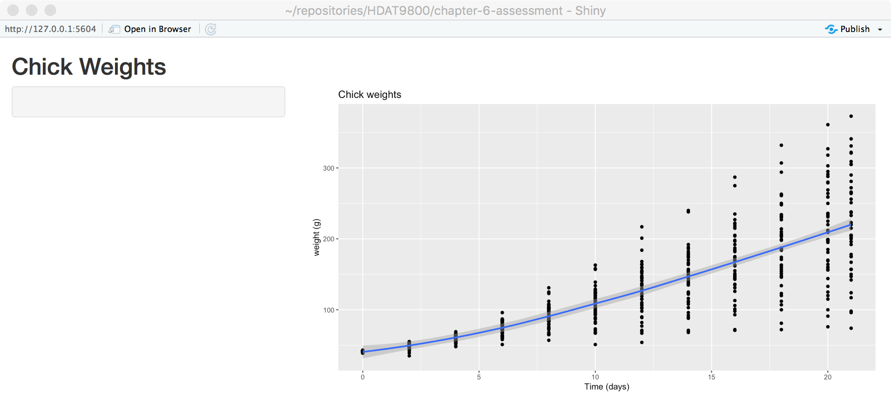
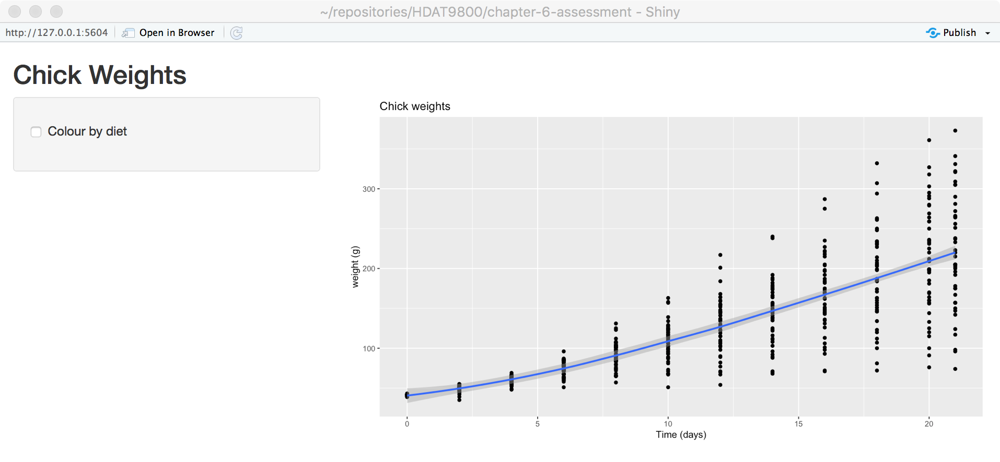
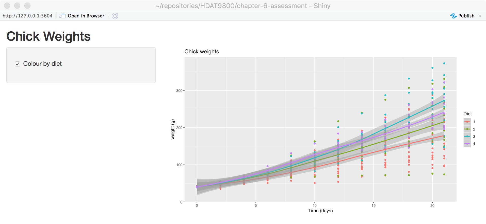
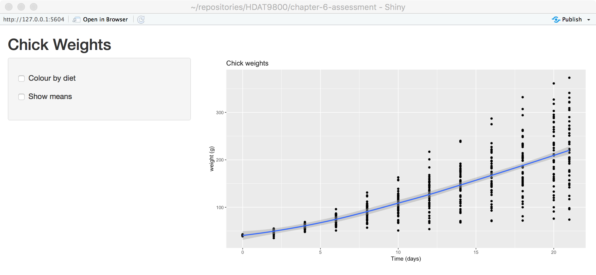
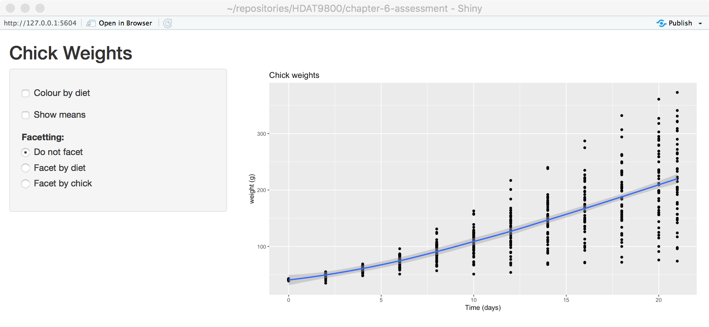

# HDAT9800 2023 Term 2 Chapter 6 optional unmarked exercise

You may wish to view this README.md document in GitHub or click the Preview button above in RStudio to see a rendered version with embedded graphics, which is a lot easier to read.

This optional, unmarked exercise is intended to help you practice and self-assess your understanding of the core curriculum material in the HDAT9800 course. It is optional, and is unmarked. However, you may wish to seek help or feedback from your course instructors if you do attempt the exercise and are unsure about any aspects of it. Please see the instructions on the [Optional Unmarked Exercises page](https://hdat9800.cbdrh.med.unsw.edu.au/optional_unmarked_exercises.html) for seeking feedback.
Your task is to create an interactive version of the analysis done in the Chapter 3 optional unmarked exercise task, as a Shiny app.

A shiny app skeleton has been created for you.

This is essentially the default skeleton for a Shiny app with the sample code removed
and replaced with placeholders.

You will need to write a Shiny app which does the following:

  1. By default display the basic ChickWeight analysis plot from the Chapter 3 exercise, given by this code
  
     ```
     ggplot(ChickWeight, aes(x=Time, y=weight)) +
       geom_point() +
       geom_smooth() +
       labs(x="Time (days)", y="weight (g)") +
       ggtitle("Chick weights")
     ```
     
     The code to generate the plot goes in the body of `renderPlot()`, the output of which is assigned to `output$chickPlot`.
     
     Remember when looking at the code that:
     
       * in the _ui_ part of the application, the `mainPanel` is displaying a plot called `chickPlot` using the `plotOutput()` function
       * in the _server_ part of the application the different parts of `input` are used to create values for the parts of `output`
         (which are then displayed by the _ui_)
         
     We suggest that you store the plot in a variable, _e.g._ `p`,
     and making the final line (the return value of the function) just `p` to return the plot,
     
     ```
     output$chickPlot <- renderPlot({
       p <- ggplot(...)
       # maybe do some other things with p
       p
     })
     ```
     
     This may seem like an unnecessary step at the moment
     but the application will be doing extra things to the plot before displaying it,
     _i.e._ colouring, facetting, and the code to do this will go between the creation of the plot (using `ggplot`)
     and the returning of the plot at the end of the function.
     
     This is the _store the plot in a variable and build it up gradually_ paradigm discussed in earlier chapters but the extra steps
     are going to be surrounded by `if` control statements to make them optional depending on the state of the user interface.
     
     If you add the code above to the body of the `renderPlot` call where indicated you should at this point have a
     Shiny app that, when run, isn't interactive but does display the _Chick weights_ plot.
     
     {style="border: 1px solid black;"}
     
  2. Add a checkbox to the sidebar panel labelled "Colour by diet" which when checked causes the plot
     to be coloured by diet by inserting this code into arguments of the `sidebarPanel()` function

     ```
     checkboxInput("colour.diet", "Colour by diet")
     ```
     
     (At this point if you run your Shiny app you will have the graph and a checkbox but clicking the checkbox will not do anything
     because we are not using it in the output function.)
     
     Add the following code between the `ggplot()` call and assignment to `p` and the return of `p` a the end of the function:
     
     ```
     if (input$colour.diet) {
       p <- p + aes(color=Diet)
     }
     ```
     
     This is saying:
     if the `colour.diet` input item is true (`colour.diet` is a checkbox so it's either `TRUE` or `FALSE`)
     then add another aesthetic to our plot (let the `color` be determined by `Diet`).
     
     (Note: although we have seen `aes()` elements used as the second argument of `ggplot` to set the default aesthetics
     but they can also be added to the plot subsequently in the same manner as `geom_point()` and `geom_smooth()`. Yes, the design of 
     `ggplot2` is ideally suited for use in Shiny, and not by accident!
     
     At this point you should have an application which changes the colour of the plot point as the checkbox is checked and unchecked.
     
     {style="border: 1px solid black;"}

     {style="border: 1px solid black;"}

     When the checkbox is toggled, Shiny recalculates the plot and redisplays it.
     
  3. Add another checkbox with an input called `show.means` and the label 'Show means' to control
     whether or not `stat_summary(color="black")` is added to the plot.
     
     Use the same technique:
     
       * add a new `checkboxInput` after the first one that's already there
         (don't forget to add a comma after the first one in the code, remember this is an argument list to `sidebarPanel`,
         _e.g._
         
         ```
         sidebarPanel(
           checkboxInput(...), # <--- you'll need a comma at the end of this line because this is really an argument list
           checkboxInput(...)
         ),
         ```
       * add a new `if` statement after the first `if` (before the last line which returns `p`) to add `stat_summary(color="black")`
         to `p` if `show.means` is `TRUE`
         (note that it's not an `if / else` construct because one, both or neither of the checkboxes might be checked).
    
     Your window should now look something like this:

     {style="border: 1px solid black;"}
     
     and clicking on the checkboxes should change the graph appropriately.
     
  4. Finally, we're going to be added a group of radio buttons to control facetting.
  
     Unlike checkboxes, only one radio button in a group can be selected.
     
     We want a group with three members:
     
       * No facetting
       * Facet by diet
       * Facet by chick
    
     We will do this by adding a `radioButtons` element to the side bar.
     
     Add a comma after the second check box and add this code:
     
     ```
     radioButtons("facet", "Facetting:", c("Do not facet" = "none",
                                      "Facet by diet" = "diet",
                                      "Facet by chick" = "chick"))
     ```
     
     This will create an input called `facet` with three items.
     The _labels_ of the items will be 'Do not facet', 'Facet by diet' and 'Facet by chick'
     but the _values_ assigned to the `facet` input for each of these will be `none`, `diet` and `chick`
     (because we have named the elements of the vector of choices).
     
     Now in our output function we can check the value of `input$facet` and facet the plot accordingly:
     
     ```
     if (input$facet == "diet") {
       p <- p + facet_wrap(. ~ Diet)
     } else if (input$facet == "chick") {
       p <- p + facet_wrap(. ~ Chick)
     }
     ```
     
     Notice that here we _can_ use `if / else` logic because the radio buttons are mutually exclusive.
     
     Your UI should now look like this:
     
     {style="border: 1px solid black;"}

     and changing the checkboxes and/or radio buttons should affect the graph.
     
Finally, carefully test your Shiny app to make sure everything works as intended. Try to test all possible combinations of all the UI controls to make    sure everything works with errors. When you are satisfied, commit your final version to git and push that to the optional unmarked exercise repository in the usual fashion. Make lots of intermediate commits (and pushes to GitHub) along the way!
     
