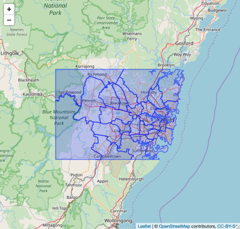

```{r setup, include=FALSE}
knitr::opts_chunk$set(echo = TRUE)

library(raster)
library(rgdal)
library(rgeos)
library(leaflet)
library(dplyr)
```

## Week 7 Assessment

This assessment expands on the material from Week 7 to build a shiny app. Most of the code you need for the app is provided in this document. Your task is to add the required code to the Shiny app skeleton provided in median_income/app.R to produce a working app.

This assessment is worth 8 marks (8% of the overall course marks).

Here are the instructions:

> Write a shiny app to show various things about Commonwealth electoral districts in Sydney. (For the sake of the workshop lets define Sydney as any CED which intersects the ‘rectangle’ bounded by 34° 4' 59.77" S, 150° 28' 4.84" E and 33° 34' 22.43" S, 151° 23' 23.81" E.)
> 
> Start by selecting all the CEDs which overlap this region.
> 
> You might want to simplify their geometries to speed up rendering.
> 
> Plot these CEDs using leaflet without using a shiny app just as a sanity check.
>
> Convert this to a shiny app which does the same thing
>
> Now work out the median income for each CED and subtract it from the national median income
>
> Colour each CED according to the difference from that national median income using a red gradient for negative and a blue gradient for positive

The data files are included in zipped form in this repository.
You'll need to unzip them to use them.
Make sure when you unzip them they don't end up inside an extra top-level directory.
This will result in the programme not being able to load them.

Unzipping `2016_PEP_AU_for_AUS_short-header.zip` should put files in a directory `2016 Census PEP Australia for AUST`
_in the same directory as the zip file_.
Some unarchiving programmes create an extra top level directory the same name as the archive,
_e.g._ `2016_PEP_AU_for_AUS_short-header/2016 Census PEP Australia for AUST/2016Census_P01_AUS.csv`
instead of `2016 Census PEP Australia for AUST/2016Census_P01_AUS.csv`.
If your unarchiving programme does this, just move the directories up one level into the project directory.
**PLEASE DO NOT COMMIT THE UNPACKED FILES AS PART OF YOUR SOLUTION**.

### Defining the bounding box

Lets define our bounding box coordinates:

```{r bounds}
LL_LAT <- -(34 + 4 / 60 + 59.77 / 3600)
LL_LONG <- 150 + 28 / 60 + 4.84 / 3600

UR_LAT <- -(33 + 34 / 60 + 22.43 / 3600)
UR_LONG <- 151 + 23 / 60 + 23.81 / 3600
```

And load the CED shap files:

```{r load-shapes}
CED_polys = readOGR("CED_2016_AUST.shp")
```

The Census data files have an id column `CED_CODE_2016` of the form `CEDxxx` where `xxx` is a numeric id.
The shape data has an id column `CED_CODE16` of the form `xxx`, _i.e._ without the `CED` prefix.

You need to take this into account when selecting by id.
The easiest thing to do is to add a `CED_CODE_2016` column to the shape data.

```{r add-augmented-shape-ids}
CED_polys$CED_CODE_2016 = factor(paste0("CED", CED_polys$CED_CODE16))
```

It will help to define a clipping function.

Clipping functions usually use something like _gIntersection_ to trim off
polygons and bits of polygons that extend outside the bounding box and keep only interior portions.
However, these return `SpatialPolygons`.

A little word about `SpatialPolygons` and `SpatialPolygonsDataFrame`:
a`SpatialPolygons` object (such as created below and returned from some _rgeos_ functions) only contain the polygon data.
You'll notice that `readOGR()` returns a `SpatialPolygonsDataFrame` which is a special object which contains
the polygons (as `@polygons`) and the data frame (as `@data`).
When `gIntersection()` returns its result it only returns a `SpatialPolygons` object and we'd need to reattach the
data to it.

So we'll use `raster::crop` instead.

```{r gClip}
gClip <- function(shp, bb){
  if (class(bb) == "matrix") {
    b_poly <- as(extent(as.vector(t(bb))), "SpatialPolygons")
  } else {
    b_poly <- as(extent(bb), "SpatialPolygons")
  }
  # to make the warning about proj4 strings go away we can
  # set the projection for our bounding box to be the same as used
  # by the CED shape data (taken from the .prj file)
  proj4string(b_poly) = "+proj=longlat +ellps=GRS80 +towgs84=0,0,0,0,0,0,0 +no_defs"
  raster::crop(shp, bb)
}
```

Lets use this to clip polygons to the Sydney bounding box

```{r sydney}
bb <- c(LL_LONG, UR_LONG, LL_LAT, UR_LAT)
Sydney_polys <- gClip(CED_polys, bb)
```

Lets check these are the right polygons.
We want them to look like this



```{r test-map}
m <- leaflet() %>%
  addTiles() %>%
  addPolygons(data=Sydney_polys, weight=2)
m
```

Yep, they look okay.

### Colouring polygons

To colour our polygons appropriately we'll want to set up a colour palette function.
This function will be responsible for taking values in our scale and turning them into `#RRGGBB` hex colour values.
Fortunately _leaflet_ has a help function to assist with this: `colorNumeric()`.

Read the manual for `colorNumeric()` but basically it takes some colour points and the numeric domain (min, max) values
and returns a _function_ which will take a number and return a colour.

This is a little tricky if you've not come across it before so lets see what happens.

```{r colorNumeric-example}
palette_fn <- colorNumeric(c("white", "orange"), c(0, 1000))
```

This creates a function called `palette_fn()` which takes a value from `0` to `1000` and returns a colour
which ranges from white at 0 to orange 1000.

(Later we'll be specifying three colours in the first vector which means we'll have a spectrum which ranges
from the first colour at the lower bound, to the second colour in the middle of the range,
to the third colour at the upper bound.
This will be useful when our range goes from -Y to +Y and we want negative/positive gradients:
we can choose a maximum negative colour, white for the middle and a maximum positive colour.)

Let's take a look at it:

```{r palette-fn}
palette_fn
```

See, a function of one parameter.

Let's feed it some values just to see what it does:

```{r palette-fn-example}
palette_fn(0)
palette_fn(500)
palette_fn(1000)
```

Numbers outside the given range are treates as `NA` and become grey so if you're seeing weird results you may have an incorrect range.

We will use this to produce an array of colour values for the `color` argument to `addPolygons()` to colour each polygon appropriately.
Something like this:

```
m <- leaflet() %>%
  addTiles() %>%
  addPolygons(data=Sydney_polys,
              stroke=FALSE,
              color=palette_fn(Sydney_polys$pop_density),
              fillOpacity=0.5)
```

### Adding a legend

Finally, we'll want to add a legend.
To do this we'll need a sequence of values for the marker points in the legend and the `seq()` function is useful here.
It takes a lower bound, an upper bound and a step value:

```{r seq-example}
seq(0, 1000, 250)
```

Choose a sensible aethetically pleasing value for the step value.

We need to add something like this to the end of the map pipeline:

```
  addLegend("bottomleft", pal = palette_fn, values = seq(0, 1000, 250),
    title = "Something sensible", opacity = 1
  )
```

### Population density

Let's first look at population density to see the approach

  * the total population for each CED is in the field `Tot_P_P` of the P01 data file
  * the area for each CED can be taken from `CED_2016_AUST.csv` by summing the `AREA_ALBERS_SQKM` field for each CED
    (this is a good chance to use the summary functions we looked at in _dplyr_)

Note that the field `CED_CODE_2016` in `CED_2016_AUST.csv` does *not* have the `CED` prefix so you'll want to add it

```{r pop-density}
# read in population info
CED_popinfo <- read.csv("2016 Census PEP Commonwealth Electoral Divisions for AUST/2016Census_P01_AUS_CED.csv")

# read in CED info
CED_info <- read.csv("CED_2016_AUST.csv")

# add the CED prefix to the CED codes
# sum the areas of the CED components
# join the population info for each CED into the table
# calculate the resulting population density
# put it all back into CED_info for later use
CED_info <- CED_info %>%
  mutate(CED_CODE_2016 = paste0("CED", CED_info$CED_CODE_2016)) %>%
  group_by(CED_CODE_2016, CED_NAME_2016) %>%
  summarise(total_area = sum(AREA_ALBERS_SQKM)) %>%
  left_join(CED_popinfo) %>%
  mutate(pop_density = Tot_P_P / total_area)

# let's check the distribution of population density
hist(CED_info$pop_density)

# looks like 0..6000 will be a good range
# let's use white -> orange
pop_pal <- colorNumeric(c("white", "orange"), c(0, 6000))

# join the CED info to our polygons so they're in the right rows for plotting
Sydney_polys@data <- left_join(Sydney_polys@data, CED_info)

# draw our map
m <- leaflet() %>%
  addMapPane("background_map", zIndex = 410) %>%  # Level 1: bottom
  addMapPane("polygons", zIndex = 420) %>%        # Level 2: middle
  addMapPane("labels", zIndex = 430) %>%          # Level 3: top
  addProviderTiles(providers$Stamen.TonerLite,
                   options = pathOptions(pane = "background_map")) %>%
  addPolygons(data=Sydney_polys,
              stroke=FALSE,
              color=pop_pal(Sydney_polys$pop_density),
              fillOpacity=0.5,
              options = pathOptions(pane = "polygons")) %>%
  addProviderTiles(providers$Stamen.TonerLabels,
                   options = pathOptions(pane = "labels")) %>%
  addLegend("bottomleft", pal = pop_pal, values = seq(0, 6000, 1000),
    title = "Population density (2016)",
    opacity = 1
  )
m
```

## Median income comparison

Next we want to load our national income data and the per-electorate income data.

Looking at the _Metadata_2016_PEP_DataPack.xlsx_ file we can see that selected medians and averages are in P02.

1. Load these two files. [0.5 marks]

```
AUST_medians <- read.csv(...)
CED_medians <- read.csv(...)
```

2. Extend the `CED_medians` data by adding a column with the difference of the median family income
from the national median family income: [1 mark]

```
CED_medians$Med_tot_family_inc_weekly_diff <- ...
```

To choose an appropriate scale for our spectrum, you might like to look at this data using something like

```
hist(CED_medians$Med_tot_family_inc_weekly_diff)
```

You should be able to look at this output and choose a sensible minimum and maximum for the scale bounds.
Use the same magnitude value for the negative lower bound and the positive upper bound:
the larger of the two, _e.g._ if the values for `CED_medians$Med_tot_family_inc_weekly_diff` go from `-500` to `250`
use the range `-500` to `500`.

3. Define the colouring scale bounds [1 mark]

```
MIN_DIFF = ...
MAX_DIFF = ...
```

4. Join the `CED_medians` data to the `Sydney_polys` polygons data frame (as in the population density example). [1.5 marks]

```
Sydney_polys@data <- left_join(...)
```

5. Define the colour palette. (You'll want three colours.) [1 mark]

```
palette_fn <- colorNumeric(..., c(MIN_DIFF, MAX_DIFF))
```

6. Draw the map with appropriately coloured polygons and an appropriately titled legend.
   (You'll want to add `labFormat = labelFormat(prefix = "$")` in the `addLegend()` function.) [1.5 marks]

```
m <- leaflet() %>%
  addTiles(..) %>%
  addPolygons(...) %>%
  addLegend(...)
m
```

7. For two last marks, change the map to use the different provider tiles as shown in the population density example
   and the different layering to have labels on top of the polygons. [2 marks]

```
m <- leaflet() %>%
  addProviderTiles(..) %>%
  addPolygons(...) %>%
  addProviderTiles(..) %>%
  addLegend(...)
m
```

And there you have it.
